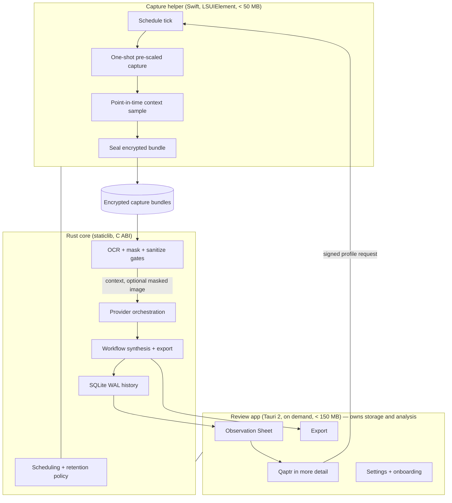
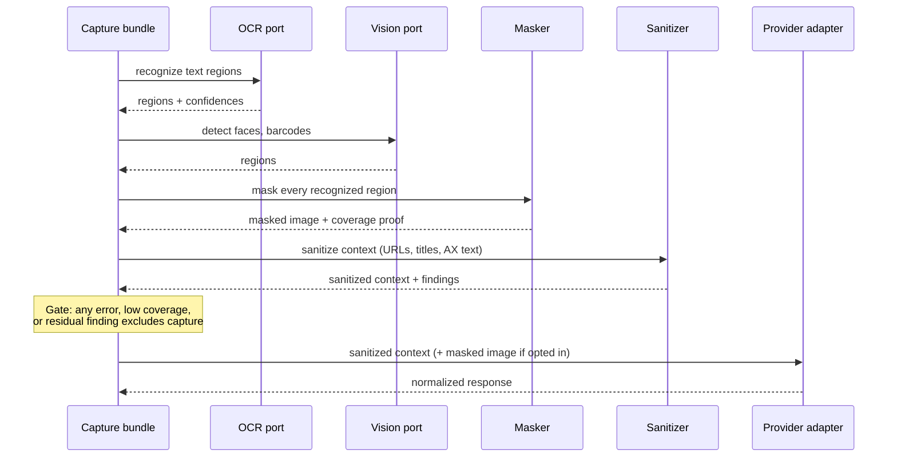
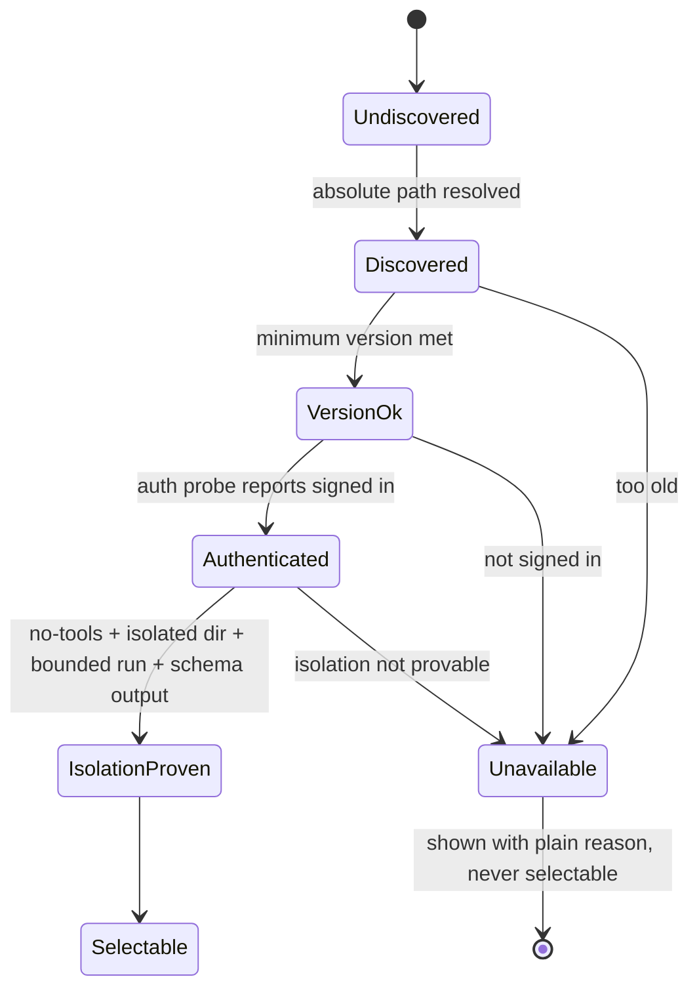

# Qaptr v1

## Goal Capsule

- **Objective:** Ship Qaptr v1 — a privacy-first Apple-silicon macOS workflow-capture app plus a waitlist website — to the Definition of Done in this document.
- **Authority hierarchy:** Product Contract > Planning Contract > Implementation Units. A conflict is resolved upward, never by silently widening scope.
- **Execution profile:** Dependency-ordered units. Prototype gates (U3, U4) must pass before their dependent shell and capture units are built out.
- **Quality authority:** The Code Quality Contract in the Planning Contract is a release gate, not advice. A unit is not done if it violates it.
- **Stop conditions:** Stop and surface a blocker when a prototype gate fails its stated budget, when a privacy guarantee cannot be honored as written, or when a provider adapter cannot satisfy the isolation contract.
- **Tail ownership:** Every unit lands with its tests, and each phase ends by re-running the Verification Contract gates that apply to it.
- **Product Contract preservation:** Product Contract unchanged. All four required providers in R-PR4 are release-gating (see KTD9).

---

## Product Contract

Qaptr is an exceptionally lightweight, privacy-first macOS menu-bar app that captures periodic visual and contextual snapshots of a person's work at one configured interval. When the person opens Qaptr, the full app processes recent captures through their chosen AI provider and presents a few concise observations about the workflows they performed, how those workflows unfolded, and which ones are worth capturing more deliberately.

The product should normally feel invisible. Its opened experience should be beautifully simple, fast, monochrome, and native-feeling, with Granola-level product simplicity, the interaction quality of Apple or Linear, and the visual ambition of Shopify Design (<https://shopify.design/>).

### Primary outcome

Help a person recognize and preserve how work actually gets done, inspect a promising workflow at greater detail, and turn it into one reusable Workflow document that can be exported for automation, team handoff, onboarding, or a general SOP.

### Core interaction

1. Qaptr runs as a lightweight menu-bar capture helper.
2. It captures selected displays on a single configurable interval, from 5 to 300 seconds.
3. At capture time, it samples lightweight context such as active app, window title, browser URL, document name, display, idle state, and temporary visible Accessibility text/structure.
4. It never records clipboard contents, raw keystrokes, or continuous Accessibility activity.
5. Opening Qaptr starts local preparation and provider-backed analysis of recent captures. No OCR or AI analysis runs in the background helper.
6. The first screen presents a small number of smart observations combining chronological context, repeated patterns, and candidate workflows.
7. A person can select an observation and choose **Qaptr in more detail**.
8. Qaptr recommends an appropriate detailed-capture interval and explains it simply.
9. Detailed capture continues until the person explicitly stops it. A subtle persistent menu-bar state makes enhanced capture visible.
10. After analysis, Qaptr creates a canonical Workflow document describing the goal, context, tools, sequence, decisions, variations, and evidence confidence.
11. The person can export that Workflow as polished Markdown tailored for automation, team handoff, onboarding, or a general SOP. Qaptr does not launch agents, create workflows, or execute automations.

### Requirements

**Capture**

- R-C1. Capture cadence is one configurable interval from 5 to 300 seconds, exposed as a single slider with a documented default.
- R-C2. Multi-display changes are handled silently.
- R-C3. Settings provide a minimal display selector for one or multiple displays.
- R-C4. High-resolution captures are downscaled before caching to reduce memory, disk, and provider costs.
- R-C5. Capture and metadata sampling happen only at the scheduled instant rather than through continuous observers.
- R-C6. The background capture process must remain below 50 MB resident memory under normal operation.
- R-C7. The opened app should remain below 150 MB resident memory during ordinary analysis and review flows.

**Privacy**

- R-P1. Screenshots are temporary processing material, not durable history.
- R-P2. The person chooses a simple cache lifetime.
- R-P3. Expired screenshots are permanently deleted: their encryption keys are destroyed and their files unlinked, making the content unrecoverable through any Qaptr path. Qaptr does not claim secure physical overwrite of storage media.
- R-P4. Durable history contains only compact workflow summaries and observations, never screenshot thumbnails.
- R-P5. OCR and PII redaction occur locally before any provider receives an image or extracted context. The guarantee is scoped to data the local recognizers detect and to the enumerated sensitive classes; residual recall is measured and disclosed rather than claimed to be zero.
- R-P6. Images that cannot be confidently redacted fail closed and are excluded from provider requests. "Confidently" means the coverage proof passes and no recognizer reports a remaining region; it does not claim detection of material no recognizer reports.
- R-P7. Exclusions are communicated quietly, for example: "1 capture was excluded because it could not be safely redacted."
- R-P8. Qaptr clearly explains that approved redacted data is sent only to the person's selected existing AI provider.
- R-P9. Provider credentials use secure operating-system storage.

**Providers**

- R-PR1. OpenRouter is built in as a bring-your-own-key option with a minimal key-entry experience.
- R-PR2. Qaptr detects compatible installed agent CLIs where feasible.
- R-PR3. CLI integrations follow a Multica-style runtime model: detect a compatible installed and already authenticated tool, verify its version and capabilities, invoke it locally, and never receive or store that tool's login tokens.
- R-PR4. Required v1 providers are OpenRouter, Claude CLI, Codex CLI, and Jcode CLI.
- R-PR5. Codex uses the person's existing CLI/OAuth login, including ChatGPT-backed Codex access where available; Qaptr does not request a separate OpenAI API key.
- R-PR6. Hermes, OpenClaw, and OpenCode remain capability-gated follow-up adapters until their non-interactive isolation contracts are proven.
- R-PR7. Provider capability differences must be hidden behind a stable adapter boundary.
- R-PR8. Unsupported or incompatible detected tools must never appear as working choices.
- R-PR9. Provider output is normalized into Qaptr's observation, canonical Workflow, and purpose-specific Markdown export formats.

**Desktop experience**

- R-D1. The menu-bar helper is quiet, low-memory, and legible at a glance.
- R-D2. The main app opens directly into recent observations rather than a dashboard full of controls.
- R-D3. The core review surface is an intentionally spare Observation Sheet, closer to Granola's focused note experience than a productivity dashboard.
- R-D4. The interface follows system light and dark appearance, using predominantly whites, blacks, and disciplined neutral tones.
- R-D5. Typography, spacing, motion, icons, loading, empty, permission, and failure states receive production-level design attention.
- R-D6. Settings remain intentionally small: capture interval, displays, cache duration, provider/model, and privacy/permission status.
- R-D7. Onboarding stages macOS permissions, display selection, capture explanation, provider selection, and privacy consent without overwhelming the person.

**Website**

- R-W1. Build a separate public Qaptr website whose primary conversion goal is joining a waitlist.
- R-W2. Use Shopify Design at <https://shopify.design/> as the specific quality reference, not a template to copy. Review that site directly before design work and match its level of editorial craft.
- R-W3. Favor expressive editorial composition, exceptional typography, purposeful motion, strong art direction, and near-monochrome restraint.
- R-W4. Avoid generic SaaS card grids, AI gradients, decorative glassmorphism, and templated landing-page structure.
- R-W5. The site must be responsive, accessible, fast, and respectful of reduced-motion preferences.

**Platform and portability**

- R-X1. v1 supports Apple-silicon macOS.
- R-X2. The core should be Rust-first.
- R-X3. Tauri is acceptable for the opened application if it best satisfies quality and memory constraints.
- R-X4. Platform-specific capture, OCR, credential, accessibility, and permission implementations must sit behind replaceable interfaces.
- R-X5. Later Windows and Linux support should require new platform adapters rather than a rewrite of workflow, storage, provider, or analysis logic.

### Explicit non-goals for v1

- Windows or Linux release.
- Cloud account system or Qaptr-managed AI credits.
- Continuous screen video recording.
- Clipboard capture, keystroke logging, or continuous Accessibility monitoring.
- Background OCR or provider analysis.
- Retaining raw screenshots or redacted thumbnails as durable history.
- Automatically creating, launching, or executing automations.
- Real-time collaboration, cloud sync, or shared workflow libraries. v1 sharing is through exported Workflow documents.

### Acceptance examples

- AE1. Given the configured capture interval on a 5K display, when the helper runs for 12 hours, then every scheduled capture is written and helper resident memory stays below 50 MB.
- AE2. Given a cache of recent captures, when the person opens Qaptr, then analysis begins without the helper having performed OCR or provider work.
- AE3. Given a capture containing an email address, an API key, and a face, when the capture is prepared for a provider, then every detected value of an enumerated sensitive class is replaced by its placeholder, any image payload has every recognizer-detected region masked, the coverage proof passes, and the measured recall floor for undetected material is disclosed.
- AE4. Given one capture whose redaction confidence gate fails, when analysis runs, then that capture is excluded, the remaining captures are analyzed, and the person sees a quiet one-line exclusion notice.
- AE5. Given an observation, when the person chooses **Qaptr in more detail** and accepts the recommended profile, then detailed capture becomes visibly active in the menu bar and continues until manually stopped.
- AE6. Given a 24-hour cache lifetime, when a capture passes 24 hours, then its encryption keys are destroyed and its image and derived files unlinked, while its summaries remain available.
- AE7. Given OpenRouter configured and one proven CLI installed, when analysis runs, then either provider completes the full observation flow and produces identical normalized output shapes.
- AE8. Given an analyzed session, when the person exports a Workflow, then Qaptr writes a canonical document and four purpose-specific Markdown exports without launching any tool.
- AE9. Given a fresh macOS user, when onboarding runs, then Screen Recording is requested with clear rationale, optional context permissions are separately explained, and no provider request occurs before explicit consent.
- AE10. Given the website, when a visitor submits the waitlist form, then the address is validated server-side, stored durably, and confirmed without a full page reload failure path.

---

## Planning Contract

### Architecture principles

Qaptr is a small native shell around a Rust core. The core owns all domain logic; the platform owns only what the platform must.

1. **One product, two processes.** A tiny always-resident capture helper and an on-demand review app that hosts analysis in-process (KTD5a). The helper never links OCR, provider, storage, or UI code.
2. **Rust-first domain.** Scheduling policy, retention, redaction policy, provider orchestration, workflow synthesis, and export live in Rust crates with no macOS types in their signatures.
3. **Ports and adapters at every OS boundary.** Capture, OCR, vision redaction, accessibility context, credential storage, permission state, and login-item registration are traits in the core with a single macOS implementation each.
4. **Deny by default.** Providers, permissions, and provider payloads start unavailable and become available only by passing an explicit gate.
5. **Fail closed on privacy.** Any error in OCR, redaction, masking, or sanitization excludes the capture. There is no lower-safety override. Residual recognizer recall is measured and disclosed rather than assumed away.
6. **Small surfaces.** Cross-boundary contracts are coarse and few. The Swift/Rust bridge is a handful of calls, not a mirror of the domain.
7. **Measured, not assumed.** Memory, capture latency, and OCR cost are asserted by tests against budgets, not reasoned about.

### Code Quality Contract

This is a release gate. Every unit satisfies it.

- **No warnings.** `cargo clippy --all-targets --all-features -- -D warnings` and `cargo fmt --check` pass. Swift builds clean; the web app passes lint and type checks.
- **No `unwrap` or `expect` in library code.** Errors are typed per crate with `thiserror`; boundaries convert once. Tests may use `expect` with a message.
- **Typed domain, not stringly typed.** Newtypes for ids, durations, byte sizes, and confidences. Illegal states are unrepresentable where an enum can prevent them.
- **No speculative abstraction.** A trait exists only where there is a real second implementation (another OS) or a real test double. No generic plugin frameworks, no config for things nobody configures.
- **Function and module size discipline.** Prefer functions that fit on a screen and modules with one reason to change. A file over roughly 400 lines needs a stated reason.
- **Dependency austerity.** Every new dependency must be justified in the unit's commit body. Prefer std, then a single well-known crate. No transitive framework pulls into the helper.
- **Boundary tests over mocks.** Test the core against in-memory adapters; test the macOS adapters against the real OS in an integration target. Do not mock what you can measure.
- **Deterministic tests.** No sleeps for synchronization, no network in unit tests, fixed clocks injected as a port.
- **Documented invariants.** Each crate's `lib.rs` states its invariants and what it must never do (for example, "never writes image bytes").
- **Public API docs.** All public items in core crates carry doc comments; `cargo doc` builds without warnings.

### Key technical decisions

- **KTD1 — Native Swift capture helper, not Tauri.** The helper is an `LSUIElement` Swift target using ScreenCaptureKit's one-shot screenshot API and `SMAppService` for login-item registration. A resident webview cannot meet the 50 MB budget (R-C6), and one-shot capture avoids maintaining a live stream. Rejected: Tauri helper (memory), `CGWindowListCreateImage` (deprecated path, worse privacy posture), a persistent `SCStream` (idle cost).
- **KTD2 — Pre-scaled, sequential, single-frame capture.** Capture requests specify the downscaled output size directly, displays are captured one at a time, and buffer depth is held at one. This keeps peak memory bounded on 5K/6K panels where a full-resolution frame alone is tens of megabytes. Satisfies R-C4, R-C6.
- **KTD3 — Native SwiftUI review app.** The opened experience is a SwiftUI app launched on demand and terminated when closed. U3 measured both candidate shells on the reference machine: both trivial probes stayed far below the opened-app memory budget, SwiftUI had the faster first meaningful paint, and both preserved the observed authorized TCC state across restart and changed rebuild. Tauri 2 is rejected for v1 because its debug signing shape was less clean and its measured cold paint was slower. The Rust core, storage, privacy, capture, and provider crates remain unchanged. Full production-shaped review-session measurements can overturn this decision; see `bench/shell_memory.md`.

- **KTD4 — Rust core as crates, with a narrow C ABI only for Swift.** The review app is Rust and depends on the core crates directly, keeping full type safety. `qaptr-ffi` exposes a small C ABI used solely by the Swift helper. One core, no duplicated domain logic, and no needless erasure of types at the Rust-to-Rust boundary. Rejected: routing the Tauri backend through the C ABI (loses type safety for no benefit), Swift reimplementation of policy (drift).
- **KTD5 — SQLite WAL with a single writer, owned by the review app.** Durable history is SQLite in WAL mode. The review app process is the only writer; analysis runs as an in-process task inside it, not a separate executable. The helper never opens the database — it records capture metadata inside the sealed bundle, and the review app ingests those bundles on open. This removes multi-process write contention entirely. Requires a bundled SQLite at or above the version carrying the 2026 WAL-reset fix rather than trusting the system library.
- **KTD5a — Explicit process ownership and IPC.** The helper owns capture and the vault write path. The review app owns storage, privacy, providers, workflow, and analysis. The only helper-to-app channel is the vault plus a small state file; the only app-to-helper channel is a signed profile request the helper polls at tick time. There is no socket, no shared database handle, and no live RPC between the two processes.
- **KTD6 — Encrypted ephemeral capture bundles with asymmetric sealing and cryptographic erasure.** A capture is a directory containing the downscaled image, sampled context, and derived artifacts. The helper seals each bundle to a generation **public** key that it can read without any secret, so the helper never holds decryption material or touches the Keychain. The matching private key lives in the Keychain and is used only by the review app to open bundles. Bundles are excluded from backup and Spotlight. Expiry performs cryptographic erasure — the private key material for that generation is destroyed and the files are unlinked — rendering the data unrecoverable through any Qaptr path. Qaptr does not claim secure physical overwrite, which APFS and SSD wear-levelling make unguaranteeable; onboarding says so plainly. Satisfies R-P1, R-P3, R-P9.
- **KTD7 — Mask all recognized text, faces, and barcodes in provider-bound images, with disclosed residual risk.** Selective PII masking cannot be honestly guaranteed from OCR, so images sent to providers have every recognized text region, detected face, and detected barcode masked. Two independent checks apply: re-running the same recognizers on the masked output must find nothing, and a labeled corpus measures recall against ground truth that the recognizers did not produce. Because no recognizer has perfect recall, image payloads are off by default (KTD8), the measured recall floor is published in `docs/release.md`, and onboarding discloses that image sending carries residual risk. Satisfies R-P5, R-P6, AE3.
- **KTD8 — Text-context-first provider payloads.** The default payload is sanitized structured context only. Fully masked images are an explicit opt-in that still requires the image gate to pass. This minimizes what leaves the device and keeps provider cost low.
- **KTD9 — Deny-by-default provider capability gate, with all four providers release-gating.** Every adapter must prove: authenticated state, non-interactive invocation, bounded output and time, cancellability, and schema-valid output. CLI adapters must additionally prove a resolved absolute executable, minimum version, tools disabled, an isolated empty working directory, and a minimized environment; the HTTP adapter proves reachability and key presence in place of those process-specific steps. All four required providers (R-PR4) must pass to ship: OpenRouter, Claude CLI, Codex CLI, and Jcode CLI. If any one cannot pass, that is a release blocker surfaced under the Goal Capsule stop conditions, not a quietly disabled adapter. Detected-but-incompatible tools outside the required four are shown with a plain reason and are never selectable (R-PR8).
- **KTD9a — Enforced isolation via a sandboxed child.** CLI adapters run inside `sandbox-exec` with a deny-by-default profile permitting only the isolated working directory, the resolved executable and its own support paths, and network egress. Filesystem denial is therefore enforced by the OS, not by convention. An adapter whose CLI cannot function under that profile fails its gate.
- **KTD10 — Just-in-time provider consent.** Local preparation may start on open, but the first provider request of a session requires explicit consent showing provider, payload kinds, capture count, and exclusions. Satisfies R-P8, AE9.
- **KTD11 — Hostname-only browser context by default.** Sampled URLs are reduced to scheme and host with path, query, and fragment stripped unless the person opts into full paths. Satisfies the spirit of R-P5 at the metadata layer.
- **KTD12 — Astro static site with one Cloudflare Worker endpoint and D1 storage.** The website is static Astro deployed to Cloudflare, with a single server-rendered waitlist endpoint backed by a Cloudflare D1 table holding email, timestamp, and a coarse source tag. Design work references <https://shopify.design/> directly for editorial composition and typographic craft. Rejected: third-party form service (extra processor, weaker privacy story), KV (no uniqueness constraint). Satisfies R-W1, R-W2, R-W5, AE10.
- **KTD13 — Deepest-first Developer ID signing and notarization.** The nested review app and any embedded binaries are signed before the outer bundle, then the whole app is notarized and shipped as a DMG. Mac App Store distribution is out of scope for v1.

### High-level technical design

Process and data topology:



Privacy gate sequence for one capture:



Provider capability gate:



### Output structure

```text
qaptr/
  Cargo.toml                        # workspace
  crates/
    qaptr-domain/                   # ids, workflow, observation, errors, clock port
    qaptr-policy/                   # capture interval, display selection, retention decisions
    qaptr-store/                    # SQLite WAL, migrations, allowlisted history
    qaptr-vault/                    # encrypted capture bundles, key generations
    qaptr-privacy/                  # OCR orchestration, masking, sanitizing, gates
    qaptr-provider/                 # adapter trait, capability gate, normalization
    qaptr-provider-openrouter/
    qaptr-provider-cli/             # shared isolated-subprocess runtime + adapters
    qaptr-workflow/                 # synthesis + Markdown exports
    qaptr-ffi/                      # narrow C ABI staticlib, consumed only by the Swift helper
    qaptr-macos/                    # macOS adapter impls behind core ports
  apps/
    helper/                         # Swift LSUIElement capture helper
    review/                         # Tauri 2 review app (Rust + web UI)
  bench/                            # memory and latency harnesses
  fixtures/privacy/                 # labeled redaction corpus
  packaging/                        # signing, notarization, DMG
  web/                              # Astro waitlist site
  docs/plans/
```

### Ownership table

| Concern | Owner | Never touches it |
|---|---|---|
| Capture tick, ScreenCaptureKit call, context sample | Capture helper | Review app |
| Vault writes (sealing new bundles) | Capture helper | — |
| Vault reads, decryption, retention reaping | Review app | Capture helper |
| OCR, masking, sanitizing, privacy gate | Review app | Capture helper |
| Provider adapters and requests | Review app | Capture helper |
| SQLite history (sole writer) | Review app | Capture helper never opens it |
| Analysis task | In-process task inside the review app | — |
| Workflow synthesis and export | Review app | Capture helper |
| Bundle sealing (write-only, public key) | Capture helper | — |
| Bundle decryption (private key) | Review app | Capture helper cannot decrypt |
| Generation keypair creation and destruction | Review app | Capture helper |
| Keychain credentials and private keys | Review app | Capture helper never touches the Keychain |
| Login-item registration | Review app on first launch | — |
| Permission requests | Review app during onboarding | Helper only reads state |
| Active capture profile | Review app writes the request, helper reads at tick | — |

The only two channels between the processes are the vault directory plus a small state file (helper to app), and a signed profile-request file the helper reads at tick time (app to helper). No socket, no shared database handle, no live RPC.

### Measurement protocol

Every budget in this plan is a number produced by a stated procedure, so a regression is detectable rather than arguable.

- **Metric.** Resident memory is the sum of `phys_footprint` across the process tree under test, sampled once per second, reported as median and peak over the window. Not RSS, which double-counts shared pages.
- **Helper budget (R-C6).** Median and peak both under 50 MB over a 12-hour soak at the configured capture interval on the reference machine.
- **Opened-app budget (R-C7).** Median under 150 MB and peak under 180 MB over a 10-minute scripted review session: open, analyze a 24-capture fixture session, open three observations, generate one workflow, export all four formats.
- **Reference machine.** Apple silicon, 16 GB, one 5K display attached, recorded by model and macOS build in `docs/release.md`. Budgets are asserted only on the reference configuration; other hardware is informational.
- **Fixture session.** A committed synthetic session of 24 captures at the production downscaled size, used by every budget and latency test so runs are comparable.
- **Latency budgets.** Capture tick under 400 ms median. Recognition alone under 500 ms median per capture, asserted in U9. Full preparation — recognition plus masking plus sanitization — under 900 ms median per capture, asserted in U12 where all three exist. Cold launch to first meaningful paint under 1200 ms median, measured as the time from process start to the first frame containing observation content, instrumented in the review app. Website Largest Contentful Paint under 1800 ms and total transferred bytes under 250 KB on a Lighthouse mobile profile with its default network and CPU throttling. Each recorded in its bench file.
- **Regression rule.** A budget test fails if the median exceeds its number, or if peak exceeds its number, on three consecutive runs. Single-run noise does not fail the suite.

### Assumptions

- A1. Apple's one-shot screenshot API can deliver a pre-scaled image without materializing a full-resolution frame in Qaptr's address space. U4 measures this; if false, capture moves to a short-lived child process that exits after each tick.
- A2. A nested Tauri app can hold the whole review experience under 150 MB across the aggregate process tree. U3 measures this; if false, the review shell becomes SwiftUI and the core, storage, privacy, and provider crates are unchanged.
- A3. Apple's on-device OCR and vision detection are fast enough to prepare a normal session's captures within a few seconds. U9 measures this.
- A4. Claude CLI and OpenRouter can both satisfy the capability gate; Codex and Jcode may not without further work. U13 and U14 decide this per adapter.
- A5. TCC screen-recording consent persists across signed builds for a stable bundle identity and team. U3 verifies this before the shell is built out.

### Sequencing

Phase 0 (U1–U2) establishes the workspace and quality gates. Phase 1 (U3–U4) runs the two prototype gates that can still change KTD3 and KTD2. Phase 2 (U5–U8, including U6a) builds the macOS adapters, capture, vault, storage, and retention. Phase 3 (U9–U12) builds the privacy pipeline and its corpus. Phase 4 (U13–U16) builds providers. Phase 5 (U17–U20) builds workflow, exports, and the review experience. Phase 6 (U21–U23) delivers the website, packaging, and release validation.

The website (U21) depends only on U1 and may be built in parallel with any macOS phase.

---

## Implementation Units

### U1. Workspace, quality gates, and domain vocabulary

- **Goal:** A Rust workspace whose quality gates fail loudly, plus the shared domain vocabulary every later unit depends on.
- **Requirements:** R-X2, R-X4, Code Quality Contract.
- **Dependencies:** none.
- **Files:** `Cargo.toml`, `rust-toolchain.toml`, `clippy.toml`, `crates/qaptr-domain/src/lib.rs`, `crates/qaptr-domain/src/ids.rs`, `crates/qaptr-domain/src/clock.rs`, `crates/qaptr-domain/src/error.rs`, `crates/qaptr-domain/tests/vocabulary.rs`, `.github/workflows/ci.yml`, `README.md`.
- **Approach:** Workspace lints deny warnings at the workspace level so no crate can opt out. `qaptr-domain` holds newtyped ids, a `Clock` port, byte/duration/confidence newtypes, and the crate-level invariant docs. No macOS types, no I/O.
- **Patterns to follow:** none yet; this unit sets the conventions later units mirror.
- **Test scenarios:** Newtypes reject invalid construction (confidence above one, zero-length id). Injected fixed clock produces deterministic timestamps. `cargo clippy -- -D warnings`, `cargo fmt --check`, and `cargo doc` all succeed on a clean tree. A deliberately warning-producing scratch commit fails CI.
- **Verification:** CI is green and a warning cannot pass it.

### U2. Ports for every OS boundary

- **Goal:** Traits for capture, OCR, vision, accessibility context, credentials, permissions, and login-item registration, with in-memory doubles.
- **Requirements:** R-X4, R-X5.
- **Dependencies:** U1.
- **Files:** `crates/qaptr-domain/src/ports/mod.rs`, `crates/qaptr-domain/src/ports/capture.rs`, `crates/qaptr-domain/src/ports/ocr.rs`, `crates/qaptr-domain/src/ports/vision.rs`, `crates/qaptr-domain/src/ports/context.rs`, `crates/qaptr-domain/src/ports/credentials.rs`, `crates/qaptr-domain/src/ports/permissions.rs`, `crates/qaptr-domain/src/testing/doubles.rs`, `crates/qaptr-domain/tests/ports.rs`.
- **Approach:** Each port is the smallest trait that expresses intent in domain terms. Ports return domain errors, never OS errors. Doubles live behind a `testing` feature so production builds cannot depend on them.
- **Patterns to follow:** `qaptr-domain` invariant documentation from U1.
- **Test scenarios:** Every port has a double that satisfies it. A port signature mentioning an OS type fails a compile-time test. Doubles can simulate denial, timeout, and partial results for each port.
- **Verification:** Core crates compile and test with no platform crate in their dependency graph.

### U3. Prototype gate: review shell identity, memory, and TCC persistence

- **Goal:** Prove or disprove KTD3 and A2/A5 before the review app is built out.
- **Requirements:** R-C7, R-D4, R-X1, R-X3; A2, A5.
- **Dependencies:** U1.
- **Files:** `bench/probes/`, `bench/shell_memory.md`, `docs/plans/qaptr-v1.md`.
- **Approach:** Build the smallest disposable Tauri 2 and native SwiftUI shells, each rendering a trivial Observation Sheet-like window. Measure aggregate `phys_footprint`, cold launch to first meaningful paint, app identity and code-signing shape, and Screen Recording TCC behavior across restart and changed rebuild. Land the measurements and the shell decision, not production UI.
- **Execution note:** This is a spike. Land the measurements and the decision, not production UI.
- **Test scenarios:** Aggregate `phys_footprint` is sampled once per second for both trivial probes, cold launch to first meaningful paint is recorded, light/dark-capable native surfaces are built, app identities and signing shapes are inspected, and consent is checked after request, relaunch, and changed rebuild. The full production fixture/session budget remains a follow-up because the review app does not exist in this spike.
- **Verification:** `bench/shell_memory.md` records the measured decision to proceed with SwiftUI, the rejected Tauri option, confidence, scope limitation, and evidence that would overturn the decision.

### U4. Prototype gate: capture cost on high-resolution displays

- **Goal:** Prove or disprove KTD2 and A1 with measurements on 5K/6K panels and multi-display changes.
- **Requirements:** R-C1 through R-C6; A1.
- **Dependencies:** U1.
- **Files:** `apps/helper/`, `bench/capture_memory.md`, `bench/scripts/capture_soak.sh`.
- **Approach:** A throwaway helper that performs one-shot pre-scaled captures of one and multiple displays, sequentially, with depth one. Measure peak and steady resident memory, per-capture latency, and behavior across display attach/detach, sleep/wake, lock, and resolution change.
- **Execution note:** Spike. Measurements and the decision are the deliverable.
- **Test scenarios:** `phys_footprint` median and peak meet the R-C6 budget across a multi-hour soak under the Measurement protocol. Peak during a 6K capture stays within that same budget. Capture tick meets its 400 ms median budget. Attaching a display does not add it to the selection and does not crash. Sleep/wake produces no catch-up burst. Locked screen is skipped.
- **Verification:** Recorded capture strategy: in-process pre-scaled capture, or a short-lived capture child process.

### U5. Encrypted capture vault with key generations

- **Goal:** Sealed, encrypted, backup-excluded capture bundles whose deletion is verifiable.
- **Requirements:** R-P1, R-P3, R-P9; KTD6.
- **Dependencies:** U2.
- **Files:** `crates/qaptr-vault/src/lib.rs`, `crates/qaptr-vault/src/bundle.rs`, `crates/qaptr-vault/src/keys.rs`, `crates/qaptr-vault/src/fs.rs`, `crates/qaptr-vault/tests/vault.rs`.
- **Approach:** A bundle is an opaque handle over an encrypted directory holding image bytes, sampled context, and derived artifacts. Sealing needs only the generation public key, so the writing process holds no decryption material; opening needs the private key from the credential port (KTD6). Bundles are excluded from backup and indexing. The crate documents that it never returns plaintext image bytes to anything but the privacy crate.
- **Patterns to follow:** Port usage from U2.
- **Test scenarios:** A sealed bundle cannot be opened with only the public key, asserted directly. Sealed contents are unreadable without the generation private key. Destroying a generation's private key makes every bundle in it unreadable. Partially written bundles are rejected on open, not silently repaired. Backup and index exclusion attributes are set. Concurrent seal and delete cannot corrupt the vault.
- **Verification:** No test can read plaintext bytes through the public API except via the privacy path.

### U6. Storage: SQLite WAL history with an allowlisted schema

- **Goal:** Durable history with an allowlisted scalar schema that has no binary
  columns, whose writer rejects raw or encoded image material in text values.
- **Requirements:** R-P4, R-C7; KTD5.
- **Dependencies:** U1.
- **Files:** `crates/qaptr-store/src/lib.rs`, `crates/qaptr-store/src/schema.rs`, `crates/qaptr-store/src/migrations/`, `crates/qaptr-store/src/history.rs`, `crates/qaptr-store/tests/store.rs`.
- **Approach:** Bundled SQLite in WAL mode with a single writer in the review-app process (KTD5) and a narrow repository API. The schema has no blob columns and no thumbnail table; a schema test asserts this. Migrations are forward-only and tested from empty.
- **Test scenarios:** Migration from empty produces the expected schema. A schema test fails if any blob column or image-like table is added. Concurrent readers see consistent snapshots during a write. A crash mid-write leaves a recoverable database. Deleting a capture's vault record leaves its observations and workflows intact, matching AE6.
- **Verification:** Schema guard test is present and fails on a deliberate blob column.

### U6a. macOS credential, permission, and login-item adapters

- **Goal:** The remaining macOS adapter implementations behind the U2 ports, so no later unit has to invent them.
- **Requirements:** R-P9, R-X4, R-D7.
- **Dependencies:** U2.
- **Files:** `crates/qaptr-macos/src/credentials.rs`, `crates/qaptr-macos/src/permissions.rs`, `crates/qaptr-macos/src/login_item.rs`, `crates/qaptr-macos/tests/credentials_integration.rs`, `crates/qaptr-macos/tests/permissions_integration.rs`.
- **Approach:** Keychain-backed credential storage with items scoped to the app and marked non-syncing, including the vault generation private keys (KTD6). The public half of each generation is written where the helper can read it without a secret. Permission state is read-only reporting for screen recording and accessibility, with a separate explicit request path. Login-item registration wraps `SMAppService` and reports its true state rather than assuming success.
- **Test scenarios:** A stored secret round-trips and is absent from any file the app writes, asserted by a filesystem scan. Deleting a credential makes reads fail with a typed absence error, not an empty string. A generation keypair can be created, its public key exported for the helper, and its private key destroyed. Permission reporting distinguishes not-determined, denied, and granted. A denied permission never reports granted. Login-item registration reports the real state and a second registration is idempotent.
- **Verification:** Integration tests pass against the real OS and no secret appears on disk outside the Keychain.

### U7. Capture helper: schedule, sample, seal

- **Goal:** The production helper that captures on schedule, samples point-in-time context, and seals bundles, within budget.
- **Requirements:** R-C1 through R-C6, R-D1, R-P1; KTD1, KTD2, KTD5a, KTD11.
- **Dependencies:** U2, U4, U5, U6a.
- **Files:** `apps/helper/Sources/QaptrHelper/`, `crates/qaptr-macos/src/capture.rs`, `crates/qaptr-macos/src/context.rs`, `crates/qaptr-policy/src/displays.rs`, `crates/qaptr-ffi/src/lib.rs`, `apps/helper/Tests/`. The single-interval control lives in `CaptureIntervalPolicy` (Swift) and its control-file store, not in a separate Rust cadence module.
- **Approach:** Swift owns only the timer, the ScreenCaptureKit call, the context sample, and the menu-bar item; every decision comes from the core through the C ABI. Context sampling is a single instantaneous read with URLs reduced to hostname by default. Sealing uses only the generation public key, so the helper holds no decryption material and never touches the Keychain (KTD6). Capture metadata is written into the sealed bundle, never to the database (KTD5a). No OCR, no provider, no analysis, and no storage code is linked into this target.
- **Test scenarios:** Interval policy schedules on the configured interval (R-C1) and does not fire while locked, asleep, or after sustained idle. Capture and context sampling occur only at the tick, asserted by counting port calls between ticks (R-C5). Captured images are downscaled to the configured size before sealing, asserted on the written bundle (R-C4). Attaching or detaching a display is handled without user interruption and without adding the new display to the selection (R-C2). Display-selection policy accepts one or several displays and rejects an empty selection; its UI lives in U20 (R-C3). No catch-up burst after wake. Menu-bar state legibly distinguishes idle, interval-based, and detailed capture. Helper never links OCR, provider, or SQLite symbols, asserted by a link-audit test. Disk quota exhaustion halts capture with a quiet notice rather than failing silently. Capture tick median stays within the latency budget.
- **Verification:** Soak run meets AE1 and the link audit passes.

### U8. Retention enforcement and quiet exclusion notices

- **Goal:** Configurable cache lifetime that actually deletes, and the quiet notice surface.
- **Requirements:** R-P2, R-P3, R-P7, R-D6; AE6.
- **Dependencies:** U5, U6.
- **Files:** `crates/qaptr-policy/src/retention.rs`, `crates/qaptr-vault/src/reaper.rs`, `crates/qaptr-store/src/notices.rs`, `crates/qaptr-policy/tests/retention.rs`.
- **Approach:** Retention is a pure policy over bundle metadata plus a reaper that executes it. Notices are compact rows with counts and reasons, never payloads.
- **Test scenarios:** A bundle past its lifetime has its keys destroyed and its image and derived files unlinked, while its summaries remain. Changing the lifetime shortens existing bundles' remaining life. Reaper is idempotent and safe to interrupt. Notice text is a count and a reason with no capture content. A retention run under low disk still completes. A reaped bundle cannot be decrypted afterwards, asserted directly.
- **Verification:** AE6 passes end to end.

### U9. Local OCR and vision detection

- **Goal:** macOS OCR and detection behind the U2 ports, with measured cost.
- **Requirements:** R-P5, R-C7; A3.
- **Dependencies:** U2, U5.
- **Files:** `crates/qaptr-macos/src/ocr.rs`, `crates/qaptr-macos/src/vision.rs`, `crates/qaptr-privacy/src/recognize.rs`, `crates/qaptr-macos/tests/ocr_integration.rs`, `bench/ocr_cost.md`.
- **Approach:** Recognized text regions carry normalized geometry and confidence; faces and barcodes carry geometry. Geometry is mapped to the downscaled image's pixel space once, in one tested function, so masking cannot drift from detection.
- **Test scenarios:** Known fixture images yield expected region counts and text. Coordinate mapping is correct at several scale factors and orientations, verified against hand-computed expectations. Empty and single-color images produce no regions and no error. OCR failure surfaces as a domain error, not a panic. Recognition cost alone meets its 500 ms median share of the preparation budget; the full preparation budget is asserted in U12 once masking and sanitization exist.
- **Verification:** Coordinate mapping tests pass at every supported scale.

### U10. Masking and coverage proof

- **Goal:** Provider-bound images with every recognized text region, face, and barcode masked, plus a machine-checkable coverage proof.
- **Requirements:** R-P5, R-P6; KTD7, KTD8; AE3.
- **Dependencies:** U9.
- **Files:** `crates/qaptr-privacy/src/mask.rs`, `crates/qaptr-privacy/src/coverage.rs`, `crates/qaptr-privacy/src/recall.rs`, `crates/qaptr-privacy/tests/mask.rs`, `crates/qaptr-privacy/tests/recall.rs`, `fixtures/privacy/images/`, `fixtures/privacy/ground_truth/`.
- **Approach:** Mask by opaque fill with a small dilation, then re-run recognition over the masked image and require that no text, face, or barcode remains. A separate labeled corpus with human-authored ground truth measures recall, so the plan knows what the recognizers miss rather than assuming they miss nothing. Coverage is the proof object the gate consumes; the measured recall floor is published.
- **Test scenarios:** A fixture with dense text yields zero recognized text after masking. Rotated and low-contrast text is masked. A face fixture yields no detection after masking. Masking an image with no detections is a no-op that still produces a valid proof. A deliberately broken masker fails the re-recognition check rather than passing. Recall against the human-labeled ground-truth corpus is computed and must meet the published floor; a corpus item the recognizers miss is recorded as a known limitation rather than silently passing.
- **Verification:** Re-recognition on the labeled corpus finds nothing on every masked output.

### U11. Context sanitization

- **Goal:** Sanitized structured context that carries meaning without carrying secrets.
- **Requirements:** R-P5, R-P6, R-P8; KTD8, KTD11.
- **Dependencies:** U9.
- **Files:** `crates/qaptr-privacy/src/sanitize.rs`, `crates/qaptr-privacy/src/classes.rs`, `crates/qaptr-privacy/tests/sanitize.rs`, `fixtures/privacy/context/`.
- **Approach:** An enumerated set of sensitive classes with documented detectors and per-class placeholders. URLs reduce to hostname by default. Window titles, document names, and temporary accessibility text pass through the same sanitizer as OCR text. Residual findings after sanitization are a gate failure, not a warning.
- **Test scenarios:** Email addresses, phone numbers, credentials and API-key shapes, payment-card shapes, national ids, addresses, and long high-entropy tokens are each replaced by their placeholder. A URL with a secret in the query is reduced to hostname. Full-path opt-in still strips credentials in the URL. A string that survives sanitization but matches a detector fails the gate. Unicode and mixed-script inputs do not corrupt output.
- **Verification:** Labeled context corpus passes with no residual finding.

### U12. Fail-closed privacy gate

- **Goal:** One decision point that decides whether a capture may reach a provider, and the only place a payload can be built.
- **Requirements:** R-P5, R-P6, R-P7; AE3, AE4.
- **Dependencies:** U10, U11.
- **Files:** `crates/qaptr-privacy/src/gate.rs`, `crates/qaptr-privacy/src/payload.rs`, `crates/qaptr-privacy/tests/gate.rs`, `bench/preparation_cost.md`.
- **Approach:** The gate composes recognition, masking, coverage, and sanitization into a single `PreparedPayload` or an exclusion with a reason. Text context is the default payload; masked images are opt-in and still gated. No caller can construct a payload without the gate.
- **Test scenarios:** OCR failure excludes the capture. Coverage failure excludes the capture. Residual sanitizer finding excludes the capture. Timeout excludes the capture. One excluded capture among five leaves four analyzable and produces exactly one quiet notice. Payload cannot be constructed outside the gate, asserted by visibility and a compile-fail test. Image payload without opt-in is never produced. A prepared payload records which sensitive classes were detected and replaced, so AE3 is checkable on the artifact rather than by inspection. Full preparation cost meets the 900 ms median budget from the Measurement protocol.
- **Verification:** AE3 and AE4 pass.

### U13. Provider adapter contract and capability gate

- **Goal:** A deny-by-default adapter boundary with a capability gate and normalized output.
- **Requirements:** R-PR3, R-PR7, R-PR8, R-PR9; KTD9.
- **Dependencies:** U1, U12.
- **Files:** `crates/qaptr-provider/src/lib.rs`, `crates/qaptr-provider/src/adapter.rs`, `crates/qaptr-provider/src/capability.rs`, `crates/qaptr-provider/src/normalize.rs`, `crates/qaptr-provider/src/schema.rs`, `crates/qaptr-provider/tests/contract.rs`.
- **Approach:** One trait, one gate, one normalized response schema. Every adapter must pass the same shared contract-test suite to be considered supported. Adapters outside the required four, including Hermes, OpenClaw, and OpenCode, are explicitly out of v1 scope (R-PR6) and are not implemented here; the trait is shaped so adding one later needs no change to callers. Unavailable detected tools carry a plain human reason.
- **Test scenarios:** A stub adapter failing any single gate step becomes unavailable with the right reason. A gate-passing stub becomes selectable. Malformed provider output is rejected by schema validation rather than partially parsed. Provider failure never falls back to a different provider. Normalized output shape is identical across two different stub adapters.
- **Verification:** The shared contract suite exists and every adapter target runs it.

### U14. Isolated subprocess runtime for CLI adapters

- **Goal:** A hardened runner that makes CLI invocation safe enough to trust with sanitized work context.
- **Requirements:** R-PR2, R-PR3, R-PR5, R-PR8; KTD9.
- **Dependencies:** U13.
- **Files:** `crates/qaptr-provider-cli/src/runtime.rs`, `crates/qaptr-provider-cli/src/discovery.rs`, `crates/qaptr-provider-cli/src/probe.rs`, `crates/qaptr-provider-cli/tests/runtime.rs`.
- **Approach:** Absolute-path execution with no shell, a minimized environment, an empty app-owned temporary working directory inside a `sandbox-exec` deny-by-default profile (KTD9a), prompt over stdin, tools disabled, bounded output size and wall time, and process-tree cancellation. GUI-launched PATH differences are handled by explicit discovery rather than inheriting a login shell.
- **Test scenarios:** A command is never interpreted by a shell, verified with adversarial argument fixtures. Output beyond the cap terminates the run. Wall-clock overrun terminates the whole process tree. Cancellation leaves no orphan. A child attempting to read the vault or the user's home is denied by the sandbox profile, asserted by an integration test that expects the denial. Environment contains only the allowlisted variables. Prompt-injection fixtures in context cannot cause tool use because tools are disabled at invocation and writes are sandbox-denied.
- **Verification:** Adversarial suite passes with no shell interpretation and no orphaned processes.

### U15. OpenRouter and Claude CLI adapters

- **Goal:** The two first providers, both passing the shared contract.
- **Requirements:** R-PR1, R-PR3, R-PR9; AE7.
- **Dependencies:** U13, U14.
- **Files:** `crates/qaptr-provider-openrouter/src/lib.rs`, `crates/qaptr-provider-openrouter/src/client.rs`, `crates/qaptr-provider-cli/src/adapters/claude.rs`, `crates/qaptr-provider-openrouter/tests/`, `crates/qaptr-provider-cli/tests/claude.rs`.
- **Approach:** OpenRouter is a minimal HTTP client with the key in the credential port and structured-output validation. Claude CLI runs non-interactively with customizations disabled, tools denied, session persistence off, and JSON output validated against the response schema.
- **Test scenarios:** Both adapters pass the shared contract suite. OpenRouter key is never written outside the credential port, asserted by a store audit test. Rate-limit and network failure surface as typed errors with no partial write. Claude adapter refuses to run when the auth probe reports signed out. Both adapters produce byte-identical normalized shapes for a fixed fixture response.
- **Verification:** AE7 passes with both providers.

### U16. Codex and Jcode adapters behind the gate

- **Goal:** Both remaining required CLIs passing the same gate, under OS-enforced isolation.
- **Requirements:** R-PR4, R-PR5, R-PR8; KTD9, KTD9a.
- **Dependencies:** U14, U15.
- **Files:** `crates/qaptr-provider-cli/src/adapters/codex.rs`, `crates/qaptr-provider-cli/src/adapters/jcode.rs`, `crates/qaptr-provider-cli/tests/codex.rs`, `crates/qaptr-provider-cli/tests/jcode.rs`, `docs/release.md`.
- **Approach:** Use each CLI's documented non-interactive mode with its strictest no-tools, ephemeral-session, and ignore-user-config options, its own existing authentication, and the KTD9a sandbox profile. Codex uses `codex exec` with tools disabled, ephemeral sessions, and user config ignored. Jcode uses `jcode run --json` with the no-tools profile and base tools disabled. Both are release-gating: a failure to pass is a blocker, not a silent disable.
- **Test scenarios:** Each adapter passes the shared contract suite. A signed-out CLI reports unavailable with the auth reason and a machine-readable reason code. Ephemeral invocation leaves no session artifacts, asserted by a filesystem diff of the sandbox and the CLI's own state directory. An adversarial prompt fixture instructing file writes produces no write, enforced by the sandbox. Output exceeding the cap terminates the run. Cancellation leaves no orphan process. Version below the documented minimum reports unavailable. Reason codes are asserted at the adapter level; U20 asserts that the settings surface renders them.
- **Verification:** Both adapters pass the shared contract suite; any failure is surfaced as a release blocker with its exact gate step.

### U17. Analysis orchestration and observations

- **Goal:** Open-time preparation and analysis that produces a few honest observations.
- **Requirements:** R-D2, R-D3, R-P7, R-C7; AE2, AE4, KTD10.
- **Dependencies:** U12, U15, U6.
- **Files:** `crates/qaptr-workflow/src/analyze.rs`, `crates/qaptr-workflow/src/observation.rs`, `crates/qaptr-workflow/src/consent.rs`, `crates/qaptr-workflow/tests/analyze.rs`.
- **Approach:** A short-lived in-process analysis task inside the review app (KTD5a) prepares bundles, requests just-in-time consent before the first provider call, then produces a small ranked set of observations combining chronology, repetition, and candidate workflows. Preparation is cancellable and streams progress. There is no separate worker executable.
- **Test scenarios:** Analysis begins without any helper-side OCR, asserted by helper-side call counters. No provider request occurs before consent. Declining consent leaves local preparation results and no network call. Cancellation mid-analysis leaves no partial observation rows. Exclusions from U12 produce exactly one aggregated notice. Observation count stays small even with many captures.
- **Verification:** AE2 and AE9's consent clause pass.

### U18. Detailed capture profile lifecycle

- **Goal:** **Qaptr in more detail** from recommendation through visible active state to manual stop.
- **Requirements:** R-D1, R-D3; AE5.
- **Dependencies:** U7, U17.
- **Files:** `crates/qaptr-policy/src/profile.rs`, `crates/qaptr-workflow/src/recommend.rs`, `apps/helper/Sources/QaptrHelper/StatusItem.swift`, `crates/qaptr-policy/tests/profile.rs`.
- **Approach:** A recommended interval derived from observed activity density with a plain-language explanation, an explicit accept step, a persistent visible menu-bar state, and no automatic time-based stop.
- **Test scenarios:** Recommendation is deterministic for a fixed session fixture and includes its rationale. Accepting activates the profile and changes menu-bar state. Detailed capture never auto-stops on a timer. Manual stop returns to the configured interval immediately. A restart while detailed capture is active preserves the active state and its visibility.
- **Verification:** AE5 passes.

### U19. Canonical Workflow document and four Markdown exports

- **Goal:** One canonical Workflow plus automation, handoff, onboarding, and SOP exports.
- **Requirements:** R-PR9; AE8.
- **Dependencies:** U17.
- **Files:** `crates/qaptr-workflow/src/document.rs`, `crates/qaptr-workflow/src/export/mod.rs`, `crates/qaptr-workflow/src/export/{automation,handoff,onboarding,sop}.rs`, `crates/qaptr-workflow/tests/export.rs`, `crates/qaptr-workflow/tests/snapshots/`.
- **Approach:** A typed canonical document covering goal, context, tools, sequence, decisions, variations, and evidence confidence, with four pure renderers over it. Exports never launch anything.
- **Test scenarios:** Canonical document round-trips through storage without loss. Each renderer produces stable snapshot output for a fixed document. Low-confidence steps are marked rather than silently asserted. Exports contain no sanitized placeholders that leak class-specific detail. No renderer performs I/O beyond returning a string. An empty or single-step workflow renders sensibly in all four formats.
- **Verification:** AE8 passes with four snapshot-tested exports.

### U20. Review experience: Observation Sheet, settings, onboarding

- **Goal:** The opened app at the intended design quality, within budget.
- **Requirements:** R-D2 through R-D7, R-C7, R-W2; AE9.
- **Dependencies:** U3, U16, U17, U18, U19.
- **Files:** `apps/review/src/`, `apps/review/src-tauri/src/`, `apps/review/src-tauri/capabilities/`, `apps/review/tests/`, `docs/design/app.md`.
- **Approach:** A spare Observation Sheet as the core surface, small settings, and staged onboarding for permissions, displays, capture explanation, provider selection, and privacy consent. Production-level attention to typography, spacing, motion, icons, and every loading, empty, permission, and failure state (R-D5), specified in `docs/design/app.md` before implementation. Tauri capabilities are minimal and explicit; the webview gets no filesystem or shell breadth.
- **Test scenarios:** Opened app meets the R-C7 budget under the measurement protocol. Light and dark appearance follow the system. Full keyboard traversal with visible focus. Reduced-motion preference disables non-essential motion. Loading, empty, permission-denied, provider-failure, and exclusion states all render deliberately. Typography, spacing, and iconography match the recorded design specification, reviewed against <https://shopify.design/> craft level. Settings expose exactly capture interval, displays, cache duration, provider/model, and privacy/permission status and nothing else. Onboarding requests Screen Recording with rationale and keeps optional context permissions separate. Capability audit shows no broad filesystem or shell permission.
- **Verification:** AE9 passes and the capability audit is clean.

### U21. Waitlist website

- **Goal:** An editorial, near-monochrome, fast waitlist site with a working production endpoint.
- **Requirements:** R-W1 through R-W5; AE10.
- **Dependencies:** U1.
- **Files:** `web/astro.config.mjs`, `web/package.json`, `web/src/pages/index.astro`, `web/src/pages/api/waitlist.ts`, `web/src/lib/validate.ts`, `web/migrations/0001_waitlist.sql`, `web/wrangler.toml`, `web/src/styles/`, `web/public/_headers`, `web/tests/`, `docs/design/website.md`.
- **Approach:** Static Astro with one Cloudflare Worker endpoint and a D1 table (KTD12), server-side validation, and minimal client JavaScript. Composition is editorial and near-monochrome (R-W3), with no card grids, gradients, or glassmorphism (R-W4). Before building, study <https://shopify.design/> and record in `docs/design/website.md` the specific compositional and typographic decisions being matched, without copying its layout or content.
- **Test scenarios:** Valid submission is stored in D1 and confirmed. Invalid addresses are rejected with clear messages and a duplicate is idempotent rather than an error. Submission works without client JavaScript. Rate limiting blocks abuse without blocking a normal visitor. Axe scan reports no violations on the landing page. Reduced-motion preference is respected. Largest Contentful Paint and transferred bytes meet the website budgets in the Measurement protocol. No secret is exposed to the client bundle. Stored records contain only email, timestamp, and a coarse source tag. A design review confirms no card grid, gradient, or glassmorphism pattern is present. The recorded rationale cites <https://shopify.design/> and names what was matched and what was deliberately not copied.
- **Verification:** AE10 passes and the accessibility and performance budgets hold.

### U22. Packaging, signing, and notarization

- **Goal:** A signed, notarized Developer ID DMG containing the outer app, nested review app, and helper.
- **Requirements:** R-X1; KTD13.
- **Dependencies:** U7, U20.
- **Files:** `packaging/release.sh`, `packaging/sign.sh`, `packaging/notarize.sh`, `packaging/dmg.sh`, `packaging/signing/entitlements.plist`, `.github/workflows/release.yml`, `docs/release.md`.
- **Approach:** Deepest-first signing of nested binaries and the nested app, then the outer bundle, then notarization and stapling, then DMG creation. Login-item registration is verified on a clean machine profile.
- **Test scenarios:** Signature verification passes on every nested binary and the outer bundle. Notarization succeeds and the ticket staples. Gatekeeper assessment passes on a fresh profile. First launch registers the login item and the helper survives logout and login. An unsigned nested binary fails the pipeline rather than shipping.
- **Verification:** A clean-machine install runs and the helper persists across a reboot.

### U23. Release validation: budgets, privacy, and provider proof

- **Goal:** One repeatable suite that proves the release-gating claims.
- **Requirements:** R-C6, R-C7, R-P6, R-PR8; AE1 through AE10.
- **Dependencies:** U8, U12, U15, U16, U19, U20, U21, U22.
- **Files:** `bench/README.md`, `bench/scripts/release_validate.sh`, `bench/scripts/capture_soak.sh`, `bench/scripts/review_budget.sh`, `bench/scripts/link_audit.sh`, `fixtures/session/`, `fixtures/privacy/README.md`, `docs/release.md`.
- **Approach:** One entry-point script that runs every Verification Contract gate in order, applies the measurement protocol including the three-run regression rule, and writes the resulting numbers and the reference-machine identity into `docs/release.md`. Failures report which gate failed and its measured value.
- **Test scenarios:** Helper soak reports median and peak under 50 MB with no missed captures. Opened-app check reports median under 150 MB and peak under 180 MB. Privacy corpus reports zero residual findings and zero unsafe payloads. Provider suites report all four required adapters passing. Export snapshots match. Website checks pass. A deliberately regressed budget fails the suite on the third consecutive run and not on transient noise.
- **Verification:** The suite is green and its numbers are recorded in `docs/release.md`.

---

## Verification Contract

Commands are run from the repository root unless a directory is named. Each command must exist and be runnable by the unit that introduces it; a gate referencing a missing target is itself a failure.

| Gate | Command | Applies to | Done signal |
|---|---|---|---|
| Format | `cargo fmt --all --check` | all Rust units | no diff |
| Lint | `cargo clippy --workspace --all-targets --all-features -- -D warnings` | all Rust units | no warnings |
| Unit and integration tests | `cargo test --workspace` | all Rust units | all pass |
| macOS OS-integration tests | `cargo test -p qaptr-macos -- --ignored` | U6a, U9 | all pass on the reference machine |
| Docs | `RUSTDOCFLAGS="-D warnings" cargo doc --workspace --no-deps` | core crates | no warnings |
| Helper tests | `swift test --package-path apps/helper` | U7, U18 | all pass |
| Helper link audit | `bash bench/scripts/link_audit.sh` | U7 | no OCR, provider, or SQLite symbols |
| Capture soak | `bash bench/scripts/capture_soak.sh --hours 12` | U4, U7, U23 | median and peak under 50 MB, zero missed captures |
| Opened-app budget | `bash bench/scripts/review_budget.sh` | U3, U20, U23 | median under 150 MB, peak under 180 MB |
| Privacy corpus | `cargo test -p qaptr-privacy --features corpus -- --include-ignored` | U10, U11, U12, U23 | zero residual findings |
| Provider contract | `cargo test -p qaptr-provider --features contract` and `cargo test -p qaptr-provider-cli --features contract -- --include-ignored` | U13, U15, U16 | all four required adapters pass |
| Export snapshots | `cargo test -p qaptr-workflow --test export` | U19 | golden documents match |
| Web checks | `npm run check && npm run test && npm run build` in `web` | U21 | pass with budgets met |
| Accessibility | `npm run test:a11y` in `web` | U21 | no violations |
| Packaging | `bash packaging/release.sh --dry-run` | U22 | signing and notarization steps verify |
| Full release suite | `bash bench/scripts/release_validate.sh` | U23 | all gates green, numbers written to `docs/release.md` |

---

## Definition of Done

Global:

1. Every unit's tests exist and pass, and all Verification Contract gates are green.
2. The Code Quality Contract holds: no warnings, no `unwrap` in library code, documented invariants, justified dependencies.
3. The helper and the opened app both meet their budgets under the Measurement protocol on the reference machine, with medians, peaks, and machine identity recorded in `docs/release.md`.
4. No provider payload can be produced except through the fail-closed gate; the privacy corpus reports zero residual findings and its measured recall floor is published in `docs/release.md`.
5. All four required providers — OpenRouter, Claude CLI, Codex CLI, and Jcode CLI — pass the capability gate and complete the end-to-end observation flow. A provider that cannot pass is a release blocker, not a disabled feature.
6. The canonical Workflow and all four Markdown exports work, and Qaptr launches nothing.
7. Onboarding takes a fresh user through permissions, displays, capture explanation, provider selection, and privacy consent, with no provider request before consent.
8. The website is live-ready, accessible, fast, respects reduced motion, and stores waitlist signups durably.
9. A signed, notarized DMG installs on a clean profile and the helper survives reboot.
10. Work is committed to `main` in small, reviewable commits whose bodies record decisions, constraints, and rejected alternatives.

Per-unit: a unit is done when its stated test scenarios pass, its verification signal holds, its files carry the documented invariants, and it introduced no new warning or unjustified dependency.

---

## Appendix

### Open questions

- Q1 (deferred). Minimum supported macOS version, decided by U3 and U4 measurements rather than assumption.
- Q2 (deferred). Whether masked images are worth offering at all, decided after U17 shows how much they improve observations over sanitized context alone and after U10 publishes the recall floor. Images are off by default either way.

No launch-blocking question remains.

### Sources and research

- Apple ScreenCaptureKit and screenshot APIs, Vision text and detection APIs, `SMAppService`, and TCC screen-recording behavior (developer.apple.com).
- Tauri 2 documentation on tray, sidecars, capabilities and permissions, macOS signing, notarization, and DMG distribution (v2.tauri.app).
- SQLite write-ahead logging documentation, including 2026 WAL-reset guidance (sqlite.org).
- Multica local runtime model for detecting and invoking already-authenticated CLIs without receiving their tokens (multica.ai/docs/install-agent-runtime, multica.ai/docs/providers).
- Codex non-interactive mode documentation (developers.openai.com/codex).
- Astro documentation for Cloudflare deployment, form handling with server-side validation, and static asset headers (docs.astro.build).
- Shopify Design (<https://shopify.design/>) as the named visual quality benchmark for the Qaptr website and opened-app polish.
- Local toolchain and CLI capability inspection performed on this machine: Rust 1.97.1, Swift 6.3.3, Claude Code 2.1.228, Codex CLI 0.147.0, Jcode 0.75.23.
